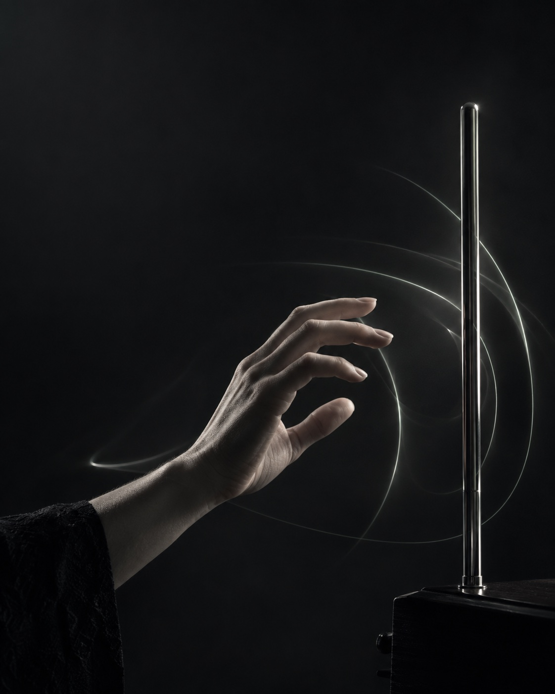

<div align="center">

# ETHER

**Play the air.**

A sonar theremin for your browser.

[Live demo](https://ether-theremin-lzx-0909.leonliuzx.chatgpt.site/) · [Quick start](#quick-start) · [Credits](#credits) · [简体中文](README.zh-CN.md)

</div>

---



### A little instrument, made from sound

Your speakers send a tone. Your microphone picks up its reflections. Move your hand, and ETHER turns the Doppler shift into music.

- **Play without touching.** Hand motion shapes continuous pitch using your computer’s speakers and microphone.
- **Find your sound.** Adjust tone, glide and reverb, with optional C-major scale assist.
- **Choose your input.** Select a microphone and see what calibration actually detects.
- **Keep audio on your device.** Microphone audio is processed locally, without recording or uploading.

The interface supports Chinese and English, with Chinese selected initially. Touch and keyboard controls are available as a fallback.

<br clear="all" />

## Quick start

Try the [live demo](https://ether-theremin-lzx-0909.leonliuzx.chatgpt.site/), or run locally with **Node.js 22.13+** and npm. No account, API key or cloud configuration is needed locally.

```sh
git clone https://github.com/mattheliu/ether-theremin.git
cd ether-theremin
npm ci
npm run dev
```

Open the localhost URL printed in the terminal. Microphone capture requires HTTPS or localhost.

1. Use built-in speakers and a physical microphone, without headphones.
2. Start sonar, grant microphone access, and remain still until calibration finishes.
3. Move your palm toward the speakers to raise pitch and away to lower it. Sound fades when motion stops.
4. Adjust tone, glide, reverb and scale assist. Stop, Escape or moving the page into the background releases the microphone and stops the probe.

The microphone selector lets you choose a specific input. Automatic mode tries a built-in microphone if the default is a recognized virtual input. Browsers may hide device labels before permission is granted.

System volume and Probe level control the sensing tone; Output volume controls only the music. Calibration tests 18.5–21 kHz by default. The optional compatibility band tries 16–18 kHz only after the high band fails. These tones may be audible to people or pets. Start quietly and stop if uncomfortable.

## Diagnostics and privacy

Open **Sonar calibration diagnostics** to see the actual input, sample rates, input level, reported audio processing and per-frequency stability.

| What you see                             | What to try                                                                                     |
| ---------------------------------------- | ----------------------------------------------------------------------------------------------- |
| Input is almost silent                   | Select a physical microphone instead of a virtual input. Check system input volume and mute.    |
| Input works, but the probe is weak       | Check speaker routing, system volume and Probe level. Output volume changes only the music.     |
| High-frequency calibration keeps failing | Try the optional compatibility band. On Mac, check microphone mode and disable Voice Isolation. |
| Device names are missing                 | Grant microphone permission first; the browser may hide labels until then.                      |

Browser-reported settings cannot rule out additional macOS or hardware processing. See [Apple’s microphone mode guide](https://support.apple.com/en-ie/guide/mac-help/mchle82b42f0/mac).

### Your audio stays with you

Audio is processed only on the device: it is not recorded, uploaded or played back. Diagnostics and device identifiers stay in page memory. Only the theme preference is stored locally. Optional WebMCP tools expose state, input enumeration, configuration and stop actions; they never start audio or request microphone permission. `state.message` contains a stable translation key.

## How it works

1. **Listen to the room.** Measure a stationary background and find a usable carrier frequency.
2. **Listen for movement.** Compare the frequency spread on either side of the carrier to estimate motion direction.
3. **Turn motion into pitch.** Integrate the signal over time, then apply the selected tone, glide and reverb.

<details>
<summary><strong>Calibration and signal processing</strong></summary>

Inspired by [Daniel Rapp’s doppler](https://github.com/DanielRapp/doppler) and [SoundWave, CHI 2012](https://www.microsoft.com/en-us/research/publication/soundwave-using-doppler-effect-sense-gestures/). The engine uses linear spectral power, a stationary baseline, a second bandwidth scan for detached peaks, and time-based pitch integration. Calibration uses a multi-frame background median and requires four stable frames per accepted carrier. Both microphone and processing sample rates constrain the usable band.

</details>

This senses motion, not absolute distance, and does not track two hands independently. It borrows the theremin’s continuous pitch expression rather than its capacitive sensing. Results depend on hardware, browser and room reflections; synthetic tests cannot validate every acoustic environment.

## Development and translation

```sh
npm run check    # Tests, TypeScript and lint
npm run build    # Build the Cloudflare Worker
npm run start    # Preview the production build locally
```

Contributions are welcome. See [CONTRIBUTING.md](CONTRIBUTING.md) for audio lifecycle, privacy and translation conventions.

<details>
<summary><strong>Project map and i18n</strong></summary>

- `app/`: playing interface, styles and metadata.
- `components/`: diagnostics, instrument history and used UI primitives.
- `lib/instrument.ts`: audio, device selection and lifecycle.
- `lib/signal.ts`: signal processing and pitch integration.
- `lib/locales/zh.ts` and `en.ts`: UI, metadata, statuses and errors.
- `lib/instrument-errors.ts`: browser failures mapped to stable message keys.
- `lib/webmcp.ts`: optional structured browser tools.
- `tests/`: synthetic signals and simulated audio devices.

Chinese defines the dictionary shape; English uses `satisfies Locale` to catch missing or misspelled keys. Add both translations for every new message. The engine emits typed `MessageKey` values, not display text. Keep translatable prose out of the engine and JSX. Brand names, source names, browser-reported device labels and tool protocol identifiers remain unchanged. Switching language does not recreate the audio engine.

</details>

<details>
<summary><strong>Deployment and source export</strong></summary>

The standalone source runs and builds without a Sites binding. For Sites hosting, configure your own `.openai/hosting.json` using `.openai/hosting.example.json` as a starting point. Never reuse another site’s project identifier.

```sh
npm run export:source -- ../ether-theremin-source
```

The allowlisted export excludes Git history, deployment bindings, dependencies, builds and temporary files. It checks for common credential patterns and local paths. The destination must not exist. Exporting does not create or publish a remote repository.

</details>

## Credits

Thank you to the people who made this experiment possible:

- **[Emanuel Perez · @emanperez28](https://x.com/emanperez28/status/2097476030680244361)** — the sonar scrolling demo on X that sparked the idea of turning hand motion into a browser instrument.
- **[Daniel Rapp · doppler](https://github.com/DanielRapp/doppler)** — the browser implementation of acoustic Doppler motion sensing, and the MIT-licensed bandwidth algorithm adapted in ETHER.
- **[SoundWave · CHI 2012](https://www.microsoft.com/en-us/research/publication/soundwave-using-doppler-effect-sense-gestures/)** — the research foundation for sensing gestures with speakers and a microphone.

The instrument’s history section draws on the [Bob Moog Foundation](https://moogfoundation.org/bob-moogs-love-of-the-theremin/), [Museums Victoria](https://collections.museumsvictoria.com.au/items/400678) and the [Clara Rockmore biography](https://nadiareisenberg-clararockmore.org/clara-rockmore-biography/). Further references and asset credits are collected in [Third-party notices](THIRD_PARTY_NOTICES.md).

## License

Project-owned code is [MIT licensed](LICENSE). Third-party materials retain their own licenses: doppler and shadcn (MIT), Manrope (OFL 1.1), and the museum photograph (CC BY 4.0). The main artwork was AI-generated for this project and is not historical imagery. See [THIRD_PARTY_NOTICES.md](THIRD_PARTY_NOTICES.md) for attribution, asset terms and historical references.
